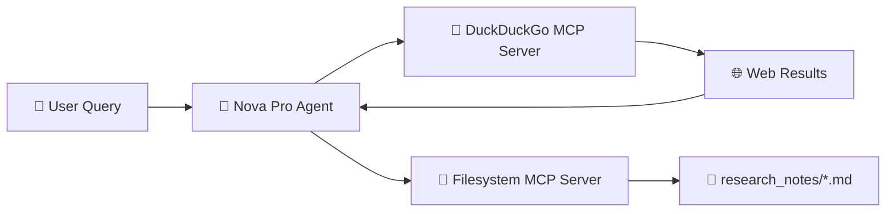

# 🚀 Builders Skill Sprint: AI Agents Challenge


Welcome to my portfolio of submissions for the **AWS User Group Madurai – Nova Month Challenge**. This repository chronicles my journey of building modern, capable AI agents from the ground up using cutting-edge AWS Generative AI technologies.

### 🛠️ Core Tech Stack
*   **🧠 Foundation Models:** Amazon Nova Pro, Amazon Bedrock, Ollama
*   **🤖 Framework:** Strands Agents SDK
*   **🔌 Extensibility:** MCP (Model Context Protocol)
*   **💾 Memory:** mem0, FAISS vector databases
*   **🔧 Capabilities:** Dynamic Tool Calling & Orchestration

The challenge was structured as a progressive learning path, focusing on building AI agents step-by-step—from simple LLM wrappers to complex, tool-using, persistent agents.

---

# ⚡ Quick Start

### Prerequisites
Before running any challenge, make sure you have:
- **Python 3.10+** installed
- **AWS Account** with Amazon Bedrock access (`us.amazon.nova-pro-v1:0` model enabled)
- **Node.js 18+** installed — required for MCP servers ([nodejs.org](https://nodejs.org/))
- **AWS CLI** configured with your credentials:
  ```bash
  aws configure
  ```

### Running the Highlight Project (Challenge 5)
```bash
# Install Python dependencies
pip install strands-agents mcp

# Navigate to the challenge directory
cd Challenge-5

# Run the Automated Researcher
python starter.py
```
> No additional API keys required! The DuckDuckGo MCP server is completely free.

---

# 📚 Challenges Completed

| Challenge | Title | Core Technologies |
| :--- | :--- | :--- |
| [**Challenge-1**](./Challenge-1/) | 🐣 First AI Agent | Ollama, Strands SDK |
| [**Challenge-2**](./Challenge-2/) | 🛠️ AI Agent with Tools | Bedrock, Nova Pro, Custom Tool Calling (`wttr.in`, `datetime`) |
| [**Challenge-3**](./Challenge-3/) | 🧠 Persistent Memory Agent | mem0, FAISS |
| [**Challenge-4**](./Challenge-4/) | 🌊 Full AI Agent | Streaming, Memory, Tools |
| [**Challenge-5**](./Challenge-5/) | 🔎 The Automated Researcher | MCP (DuckDuckGo, Filesystem), Bedrock, Nova Pro |

---

# 💡 Key Learnings

Through this intensive skill sprint, I gained profound hands-on experience in the AI agent lifecycle:

*   **Agent Construction:** Building autonomous AI Agents using the Strands SDK.
*   **AWS Integration:** Deep integration with Amazon Bedrock and maximizing the potential of the Amazon Nova Pro model.
*   **Tool Orchestration:** Creating and routing custom tools (via the `@tool` decorator) to give the LLM real-world capabilities.
*   **Persistent Memory:** Moving beyond simple conversation history to implementing true persistent memory using local vector stores (FAISS).
*   **MCP (Model Context Protocol):** Leveraging MCP to seamlessly, safely, and securely integrate external APIs and file systems without writing boilerplate integration code.
*   **Security & Sandboxing:** Performing safe filesystem operations within strict sandbox constraints.
*   **Prompt Engineering:** Advanced AI architecture design and system prompting.

---

# 🌟 Highlight Project — The Automated Researcher 🔎📂

The capstone project of this challenge was **The Automated Researcher**, a fully functional AI-powered personal research assistant.

Unlike traditional LLM chats, this agent autonomously browses the web, synthesizes information, and manages its own filesystem.

## 🎯 What It Does

Provide the agent with a topic (e.g., *"Research quantum computing for beginners and save notes"*), and it will:
1.  Search the live web for the most up-to-date information.
2.  Synthesize the scattered findings into a cohesive, structured markdown study guide.
3.  Automatically save the guide directly to your local machine in a dedicated `research_notes/` directory.

## 🗺️ Architecture & Flow



## 🚀 Capabilities

*   **🌐 Zero-Config Web Search:** Integrates the DuckDuckGo MCP Server for real-time web research—completely free, with no API keys required.
*   **📝 Automated Synthesis:** Distills massive amounts of web data into highly structured, readable formats (titles, bullet points, source links).
*   **💾 Sandboxed File Management:** Uses the Filesystem MCP Server to create directories and write markdown notes, restricted strictly to a safe `research_notes/` folder to prevent unauthorized file access.
*   **🔄 Conversational Workflow:** Features a continuous, interactive CLI chat loop. You can ask follow-up questions or queue multiple research topics in a single session.
*   **🧠 Nova Pro Powered:** Driven by the highly capable `us.amazon.nova-pro-v1:0` model on AWS Bedrock for superior reasoning and tool selection.

## ⚠️ Limitations & Disadvantages

While powerful, the current architecture has a few limitations:
*   **Speed/Latency:** Because the agent must make sequential calls (Search Web ➡️ Read Results ➡️ Synthesize ➡️ Write File), complex queries can take several minutes to complete, especially if the model decides to run multiple searches.
*   **Streaming Compatibility:** To ensure reliable MCP tool execution, model streaming had to be handled carefully. Extremely long research outputs might feel delayed since the text doesn't always stream fluidly while tools are executing.
*   **Search Depth:** It currently relies on DuckDuckGo's surface-level search. It cannot bypass paywalls or read deeply nested PDFs without additional specialized MCP servers.

---

# 📁 Repository Structure

```text
builders-skill-sprint-challenges/
│
├── Challenge-1/
├── Challenge-2/
├── Challenge-3/
├── Challenge-4/
├── Challenge-5/
│   ├── starter.py               # The Automated Researcher core logic
│   ├── implementation_plan.md   # Architectural design document
│   └── research_notes/          # Sandboxed output directory
└── README.md
```

---

# 🏆 Challenge Submission

| Field | Details |
| :--- | :--- |
| **Event** | AWS User Group Madurai — Nova Month Challenge |
| **Submission** | Builders Skill Sprint: AI Agents |
| **Capstone Project** | The Automated Researcher (Challenge 5) |
| **Core Model** | Amazon Nova Pro (`us.amazon.nova-pro-v1:0`) |
| **Submission Portal** | [awsugmdu.in](https://www.awsugmdu.in/) |

---

# 🔭 Future Goals

Moving forward, I plan to expand on these foundations to explore:

*   **Advanced RAG Systems:** Combining MCP with massive enterprise document stores.
*   **Multi-Agent Workflows:** Having one agent search, another critique, and a third format the data.
*   **AI Automation:** Triggering agents based on cron jobs or webhooks.
*   **Production-Grade GenAI:** Taking these local CLI tools and deploying them as scalable, serverless cloud applications.
